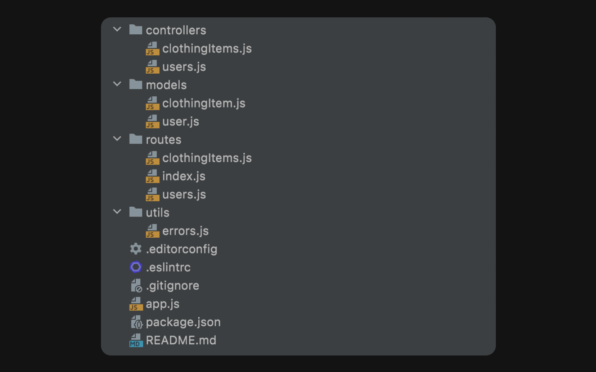

# WTWR (What to Wear?): Back End
This project served as a learning tool to understand how to build and work on the backend of a web application. It covered setting up a linter, configuring entry points, and enabling hot reloading. I also learned how to connect Mongoose to the project and worked with Schemas, Routes, and Controllers. To wrap it up, I used Postman for testing endpoints and GitHub Actions to automate code testing before submission.

## 🧰 Tech Stack
- [Express.js](https://expressjs.com/)
- [MongoDB](https://www.mongodb.com/)
- [Mongoose](https://mongoosejs.com/)
- [Postman](https://www.postman.com/)
- [GitHub Actions](https://github.com/features/actions)

## 📁 File Structure

## 🚧 Feedback
As this is a work in progess with learning the backend of the project, all feedback is welcomed. 

If you see a bug - **let's kill it!**
